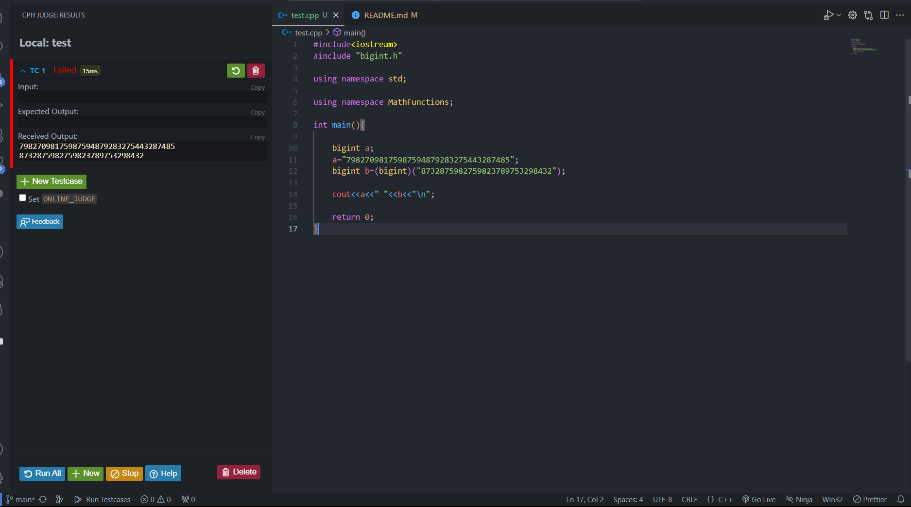
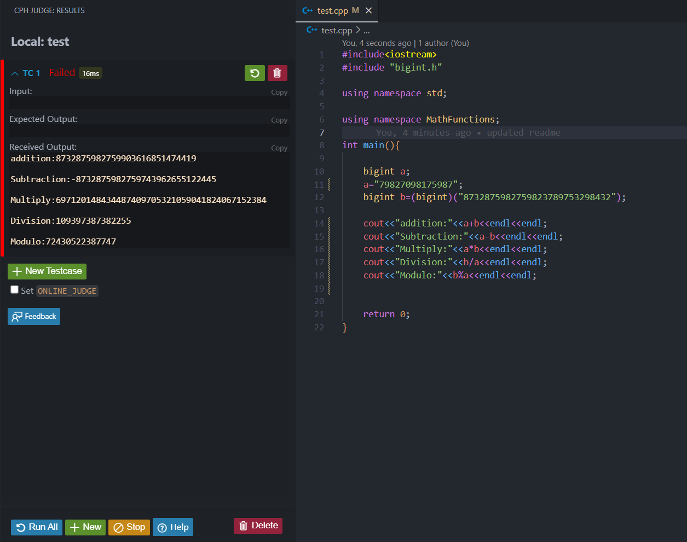

# big_integer_Library (C++)

## Features-

 1) Addition -> +
 2) Subtraction -> -
 3) Multiplication -> *
 4) Division -> /
 5) Modulo -> %

## Math Functions-
 
 1) Factorial(n)
 2) Gcd(a,b)
 3) Lcm(a,b)
 4) Pow(x,n)
 
 
## How to use -

* Step 1
    * To make submissions on online judges (Codechef,Codeforces etc) ->
    
      * Copy the code from [bigint.h](https://github.com/toastmaster-Pritam/big_integer_Library/blob/main/bigint.h) and paste it in you solution file.
      
    * To use it locally ->
    
      * Clone this repository and place [bigint.h](https://github.com/toastmaster-Pritam/big_integer_Library/blob/main/bigint.h) in same path as of your project.
     
     * Just you wanna add these two lines at the start of your file.
     
       * #include "bigint.h" 
       * using namespace MathFunctions
    
* Step 2

  * Now we can use all of the above features for Big integers.
  
    ## Declarations and Initializations ->
    
    
    
    ## Arithmetic Operations ->
    
    
    
    ## Math Functions ->
    
    

     
     
    
    
      

